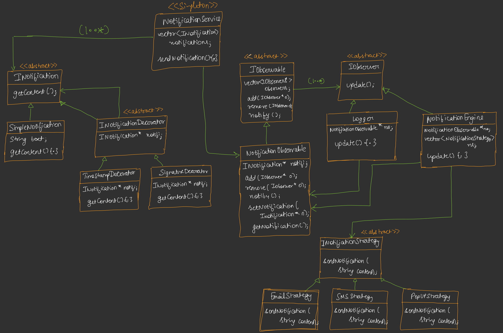

# Notification System — Low-Level Design (LLD)

A low-level design for a **flexible, extensible notification system** that supports:

- Multiple notification types/formats
- Notification decorators such as timestamp/signature
- Multiple delivery channels such as Email, SMS, and Popup
- Multiple observers that react when a notification is generated
- Pluggable notification delivery strategies
- A centralized notification service
- Easy addition of new notification types, decorators, observers, and delivery channels

The design intentionally uses three classic design patterns:

1. **Decorator Pattern** — dynamically adds behavior/metadata to a notification.
2. **Observer Pattern** — allows multiple components to react to notification events.
3. **Strategy Pattern** — allows the delivery mechanism to be changed independently.

A **Singleton** is also used for the `NotificationService` so that the application has one centralized notification service instance.

---

## 1. UML Diagram



> Keep `UML.jpeg` in the same directory as this `README.md` if you want the diagram to render on GitHub.

---

# 2. Problem Statement

Suppose an application needs to send notifications to users.

Initially, it may only support something simple such as:

```text
"Your order has been shipped."
```

sent through email.

Over time, requirements grow:

- Send the same notification through SMS.
- Show it as an in-app popup.
- Add a timestamp.
- Add a digital signature.
- Log every notification.
- Trigger analytics whenever a notification is generated.
- Add push notifications later.
- Add WhatsApp later.
- Allow new notification formats without modifying existing code.

A poorly designed system can quickly become a large set of `if-else` statements:

```cpp
if (type == "email") {
    // email logic
}
else if (type == "sms") {
    // SMS logic
}
else if (type == "popup") {
    // popup logic
}
```

and:

```cpp
if (addTimestamp) {
    // add timestamp
}

if (addSignature) {
    // add signature
}
```

This violates important design principles such as **Open/Closed Principle** and makes the system difficult to extend.

This LLD separates these responsibilities using abstractions and design patterns.

---

# 3. High-Level Architecture

The system can be understood as four major parts:

```text
                     +----------------------+
                     | NotificationService  |
                     |     <<Singleton>>    |
                     +----------+-----------+
                                |
                                v
                     +----------------------+
                     | Notification         |
                     |     <<abstract>>     |
                     | getContent()         |
                     +----------+-----------+
                                ^
                                |
                  +-------------+-------------+
                  |                           |
        +---------+----------+       +--------+----------+
        | SimpleNotification |       | NotificationDecorator
        | getContent()        |       | notification*
        +--------------------+       +--------+----------+
                                              ^
                                    +---------+---------+
                                    |                   |
                            +-------+------+    +-------+------+
                            | Timestamp    |    | Signature    |
                            | Decorator    |    | Decorator    |
                            +--------------+    +--------------+


                     NotificationObservable
                     <<implements IObservable>>
                              |
                    +---------+---------+
                    |                   |
                 Logger          NotificationEngine
                                      |
                                      v
                           NotificationStrategy
                           <<abstract>>
                              ^
                  +-----------+-----------+-----------+
                  |                       |           |
             EmailStrategy          SMSStrategy   PopupStrategy
```

---

# 4. Design Patterns Used

## 4.1 Decorator Pattern

### Purpose

The Decorator Pattern allows us to add additional behavior to an object **without modifying the original class**.

The base abstraction is:

```cpp
class Notification {
public:
    virtual string getContent() = 0;
};
```

A basic notification can be:

```cpp
class SimpleNotification : public Notification {
    string text;

public:
    SimpleNotification(string text) {
        this->text = text;
    }

    string getContent() override {
        return text;
    }
};
```

Now suppose we want to add a timestamp.

Instead of changing `SimpleNotification`, we create:

```cpp
class NotificationDecorator : public Notification {
protected:
    Notification* notification;

public:
    NotificationDecorator(Notification* notification) {
        this->notification = notification;
    }
};
```

Then:

```cpp
class TimestampDecorator : public NotificationDecorator {
public:
    TimestampDecorator(Notification* notification)
        : NotificationDecorator(notification) {}

    string getContent() override {
        return notification->getContent() + " [timestamp]";
    }
};
```

Similarly:

```cpp
class SignatureDecorator : public NotificationDecorator {
public:
    SignatureDecorator(Notification* notification)
        : NotificationDecorator(notification) {}

    string getContent() override {
        return notification->getContent() + " [signature]";
    }
};
```

### Why Decorator?

Without Decorator, we might create classes such as:

```text
SimpleNotification
TimestampNotification
SignatureNotification
TimestampSignatureNotification
TimestampSignaturePriorityNotification
...
```

This creates a **class explosion**.

With Decorator, features can be composed dynamically:

```cpp
Notification* notification =
    new SimpleNotification("Order shipped");

notification =
    new TimestampDecorator(notification);

notification =
    new SignatureDecorator(notification);
```

Conceptually:

```text
SignatureDecorator
        |
TimestampDecorator
        |
SimpleNotification
```

Calling:

```cpp
notification->getContent();
```

passes through the entire chain.

### Main advantage

New notification modifications can be introduced without modifying existing notification classes.

---

# 5. Observer Pattern

## 5.1 Purpose

The Observer Pattern is used when one object changes state or produces an event and **multiple other objects need to react to that event**.

The UML contains:

```text
IObservable
    |
    +---- NotificationObservable
```

and:

```text
IObserver
    |
    +---- Logger
    +---- NotificationEngine
```

---

## 5.2 IObserver

The observer abstraction is:

```cpp
class IObserver {
public:
    virtual void update() = 0;
};
```

Every observer must implement:

```cpp
update()
```

For example:

```cpp
class Logger : public IObserver {
public:
    void update() override {
        // log notification
    }
};
```

---

# 6. IObservable

The observable abstraction maintains a collection of observers.

Conceptually:

```cpp
class IObservable {
protected:
    vector<IObserver*> observers;

public:
    virtual void add(IObserver* observer) = 0;
    virtual void remove(IObserver* observer) = 0;
    virtual void notify() = 0;
};
```

The UML shows a:

```text
vector<IObserver*> observers
```

which means one observable can have **many observers**.

The multiplicity is:

```text
Observable 1 -------- * Observer
```

Meaning:

> One observable can notify zero or more observers.

---

# 7. NotificationObservable

`NotificationObservable` is the concrete observable.

It maintains:

```cpp
Notification* notification;
```

and provides operations such as:

```cpp
add(IObserver*)
remove(IObserver*)
notify()
setNotification(Notification*)
getNotification()
```

A simplified version:

```cpp
class NotificationObservable : public IObservable {
private:
    Notification* notification;

public:
    void add(IObserver* observer) override {
        observers.push_back(observer);
    }

    void remove(IObserver* observer) override {
        // remove observer
    }

    void notify() override {
        for (IObserver* observer : observers) {
            observer->update();
        }
    }

    void setNotification(Notification* notification) {
        this->notification = notification;
    }

    Notification* getNotification() {
        return notification;
    }
};
```

---

# 8. Why Observer Pattern?

Suppose we have:

```text
NotificationObservable
        |
        +---- Logger
        |
        +---- NotificationEngine
        |
        +---- AnalyticsObserver
        |
        +---- AuditObserver
```

When a notification event occurs:

```text
NotificationObservable
        |
        +----> Logger.update()
        |
        +----> NotificationEngine.update()
        |
        +----> AnalyticsObserver.update()
        |
        +----> AuditObserver.update()
```

The observable does not need to know the concrete implementation details of each observer.

This gives us loose coupling.

For example, we can add:

```cpp
class AnalyticsObserver : public IObserver {
public:
    void update() override {
        // update metrics
    }
};
```

without modifying `NotificationObservable`.

---

# 9. Strategy Pattern

## 9.1 Purpose

The Strategy Pattern is used when we have **multiple algorithms/ways of performing the same operation** and want to switch between them.

Here the operation is:

```cpp
sendNotification(string content)
```

The UML contains:

```text
NotificationStrategy
        ^
        |
   +----+-----+-------------+
   |          |             |
EmailStrategy SMSStrategy PopupStrategy
```

---

# 10. NotificationStrategy

The strategy interface is:

```cpp
class NotificationStrategy {
public:
    virtual void sendNotification(string content) = 0;
};
```

Every delivery mechanism implements this interface.

---

# 11. EmailStrategy

```cpp
class EmailStrategy : public NotificationStrategy {
public:
    void sendNotification(string content) override {
        // send email
    }
};
```

Its responsibility is only email delivery.

It does not need to know how a notification was created or decorated.

---

# 12. SMSStrategy

```cpp
class SMSStrategy : public NotificationStrategy {
public:
    void sendNotification(string content) override {
        // send SMS
    }
};
```

---

# 13. PopupStrategy

```cpp
class PopupStrategy : public NotificationStrategy {
public:
    void sendNotification(string content) override {
        // display popup
    }
};
```

---

# 14. Why Strategy Pattern?

Without Strategy, `NotificationEngine` could contain:

```cpp
if (type == EMAIL) {
    // email
}
else if (type == SMS) {
    // SMS
}
else if (type == POPUP) {
    // popup
}
```

Every time a new channel is added, we would need to modify `NotificationEngine`.

With Strategy:

```cpp
NotificationStrategy* strategy;
```

The engine simply calls:

```cpp
strategy->sendNotification(content);
```

It does not care whether the strategy is:

```text
EmailStrategy
SMSStrategy
PopupStrategy
PushStrategy
WhatsAppStrategy
```

This follows the **Open/Closed Principle**.

---

# 15. NotificationEngine

`NotificationEngine` is an observer.

It implements:

```cpp
IObserver
```

and therefore provides:

```cpp
update()
```

The UML shows:

```cpp
NotificationObservable* observable;
vector<NotificationStrategy*> strategies;
```

So the engine:

1. Receives notification events through `update()`.
2. Gets the current notification.
3. Extracts its content.
4. Uses one or more strategies to deliver it.

Conceptually:

```cpp
class NotificationEngine : public IObserver {
private:
    NotificationObservable* observable;
    vector<NotificationStrategy*> strategies;

public:
    void update() override {
        Notification* notification =
            observable->getNotification();

        string content =
            notification->getContent();

        for (NotificationStrategy* strategy : strategies) {
            strategy->sendNotification(content);
        }
    }
};
```

---

# 16. Why Does NotificationEngine Implement Observer?

This is an important relationship in the design.

The `NotificationEngine` does not continuously poll for notifications.

Instead:

```text
NotificationObservable
        |
        | notify()
        v
NotificationEngine.update()
```

When the notification changes, the engine is informed.

This is better than repeatedly asking:

```cpp
"Is there a new notification?"
```

because the engine reacts only when an event occurs.

---

# 17. NotificationService

The UML marks `NotificationService` as:

```text
<<Singleton>>
```

The purpose of the service is to provide a centralized entry point for sending notifications.

Conceptually:

```cpp
class NotificationService {
private:
    static NotificationService* instance;

    NotificationObservable* observable;

    NotificationService() {}

public:
    static NotificationService* getInstance();

    void sendNotification(Notification* notification);
};
```

The UML shows the service holding:

```cpp
vector<Notification> notifications;
```

and exposing:

```cpp
sendNotification(...)
```

---

# 18. Why Singleton?

Suppose different parts of the application create their own notification services:

```text
Controller A -> NotificationService A
Controller B -> NotificationService B
Controller C -> NotificationService C
```

This can lead to inconsistent configuration and duplicated state.

Instead, the Singleton provides:

```text
Controller A
      |
Controller B ---> NotificationService
      |               |
Controller C          v
                Notification System
```

All clients access the same service instance.

### Typical Singleton implementation

```cpp
class NotificationService {
private:
    NotificationService() {}

public:
    static NotificationService& getInstance() {
        static NotificationService instance;
        return instance;
    }

    NotificationService(const NotificationService&) = delete;
    NotificationService& operator=(
        const NotificationService&) = delete;
};
```

Using a function-local static object is generally preferable to manually managing a raw pointer.

---

# 19. Complete Notification Flow

The complete system can be understood through the following sequence.

Suppose the application wants to send:

```text
"Your order has been shipped."
```

with:

- timestamp
- signature
- email
- SMS
- popup

---

## Step 1 — Create the base notification

```cpp
Notification* notification =
    new SimpleNotification(
        "Your order has been shipped."
    );
```

At this point:

```text
SimpleNotification
    |
    +-- "Your order has been shipped."
```

---

## Step 2 — Add timestamp

```cpp
notification =
    new TimestampDecorator(notification);
```

Now:

```text
TimestampDecorator
        |
        v
SimpleNotification
```

Calling:

```cpp
notification->getContent();
```

returns something like:

```text
Your order has been shipped. [timestamp]
```

---

## Step 3 — Add signature

```cpp
notification =
    new SignatureDecorator(notification);
```

Now the chain becomes:

```text
SignatureDecorator
        |
TimestampDecorator
        |
SimpleNotification
```

The final content becomes:

```text
Your order has been shipped. [timestamp] [signature]
```

---

# 20. Step 4 — Set the Notification

The service/observable associates the newly created notification with the observable:

```cpp
observable->setNotification(notification);
```

Conceptually:

```text
NotificationObservable
        |
        +---- notification
                 |
                 v
        SignatureDecorator
                 |
                 v
        TimestampDecorator
                 |
                 v
        SimpleNotification
```

---

# 21. Step 5 — Notify Observers

The observable calls:

```cpp
observable->notify();
```

This loops through all observers:

```cpp
for (IObserver* observer : observers) {
    observer->update();
}
```

For example:

```text
NotificationObservable
        |
        +----> Logger.update()
        |
        +----> NotificationEngine.update()
```

---

# 22. Step 6 — Logger Receives Event

The logger reacts:

```cpp
void Logger::update() {
    // record notification event
}
```

It can be used for:

- debugging
- audit trails
- monitoring
- compliance
- application logs

The logger does not need to know how the notification is delivered.

---

# 23. Step 7 — NotificationEngine Receives Event

The engine's:

```cpp
update()
```

method executes.

It retrieves:

```cpp
Notification* notification =
    observable->getNotification();
```

and then:

```cpp
string content =
    notification->getContent();
```

Because the notification is decorated, the engine automatically receives the **final decorated content**.

The engine does not need to know whether the notification has:

- timestamp
- signature
- priority
- encryption
- localization

---

# 24. Step 8 — NotificationEngine Uses Strategies

Suppose the engine contains:

```cpp
vector<NotificationStrategy*> strategies;
```

with:

```text
EmailStrategy
SMSStrategy
PopupStrategy
```

The engine can do:

```cpp
for (auto strategy : strategies) {
    strategy->sendNotification(content);
}
```

Result:

```text
                   +--> EmailStrategy --> Email
                   |
NotificationEngine +--> SMSStrategy   --> SMS
                   |
                   +--> PopupStrategy --> Popup
```

---

# 25. Complete Sequence Diagram

```text
Client
  |
  | create SimpleNotification
  v
SimpleNotification
  |
  | wrap with TimestampDecorator
  v
TimestampDecorator
  |
  | wrap with SignatureDecorator
  v
SignatureDecorator
  |
  | send notification
  v
NotificationService
  |
  | setNotification()
  v
NotificationObservable
  |
  | notify()
  +----------------------+
  |                      |
  v                      v
Logger              NotificationEngine
                         |
                         | getNotification()
                         v
                    Notification
                         |
                         | getContent()
                         v
                    Final content
                         |
             +-----------+-----------+
             |           |           |
             v           v           v
        EmailStrategy SMSStrategy PopupStrategy
             |           |           |
             v           v           v
           Email         SMS        Popup
```

---

# 26. Class Responsibilities

| Class / Interface | Responsibility |
|---|---|
| `Notification` | Defines the common notification abstraction |
| `SimpleNotification` | Stores the basic notification text |
| `NotificationDecorator` | Base decorator that wraps another notification |
| `TimestampDecorator` | Adds timestamp information |
| `SignatureDecorator` | Adds signature information |
| `IObservable` | Defines observer registration and notification operations |
| `NotificationObservable` | Maintains notification state and observers |
| `IObserver` | Defines the observer contract |
| `Logger` | Logs notification events |
| `NotificationEngine` | Processes notification events and dispatches them |
| `NotificationStrategy` | Defines the notification delivery interface |
| `EmailStrategy` | Sends notifications through email |
| `SMSStrategy` | Sends notifications through SMS |
| `PopupStrategy` | Sends notifications through popup/in-app UI |
| `NotificationService` | Centralized notification service / entry point |

---

# 27. Relationships in the UML

## Notification inheritance

```text
Notification
      ^
      |
SimpleNotification
```

`SimpleNotification` **is a** `Notification`.

---

## Decorator inheritance

```text
Notification
      ^
      |
NotificationDecorator
      ^
      |
+-----+----------------+
|                    |
TimestampDecorator  SignatureDecorator
```

Both decorators are also `Notification`s.

This is important because decorators can be used anywhere a `Notification*` is expected.

---

## Observer inheritance

```text
IObserver
    ^
    |
+---+----------------+
|                    |
Logger        NotificationEngine
```

Both classes can receive notification events.

---

## Observable inheritance

```text
IObservable
     ^
     |
NotificationObservable
```

`NotificationObservable` provides the actual implementation for managing observers.

---

## Strategy inheritance

```text
NotificationStrategy
        ^
        |
+-------+-------+----------+
|               |          |
EmailStrategy SMSStrategy PopupStrategy
```

All delivery mechanisms satisfy the same interface.

---

# 28. Important Design Principle: Program to Interfaces

The system heavily relies on abstractions.

For example:

```cpp
NotificationStrategy* strategy;
```

instead of:

```cpp
EmailStrategy* strategy;
```

Similarly:

```cpp
Notification* notification;
```

instead of:

```cpp
SimpleNotification* notification;
```

This means high-level components depend on **interfaces**, not concrete implementations.

---

# 29. Open/Closed Principle

The system is designed so that existing classes should require minimal or no modification when new functionality is added.

For example, to add Push Notifications:

```cpp
class PushStrategy : public NotificationStrategy {
public:
    void sendNotification(string content) override {
        // send push notification
    }
};
```

No modification is required in:

```text
NotificationEngine
Notification
EmailStrategy
SMSStrategy
PopupStrategy
```

We simply introduce a new strategy.

---

# 30. Adding WhatsApp

Similarly:

```cpp
class WhatsAppStrategy : public NotificationStrategy {
public:
    void sendNotification(string content) override {
        // WhatsApp implementation
    }
};
```

The engine remains unchanged.

---

# 31. Adding a New Notification Type

Suppose we need a rich notification:

```text
Title
Body
Priority
Metadata
```

We can introduce:

```cpp
class RichNotification : public Notification {
public:
    string getContent() override {
        // construct rich content
    }
};
```

The decorators can still wrap it:

```text
SignatureDecorator
        |
TimestampDecorator
        |
RichNotification
```

No change to the delivery strategies is necessary.

---

# 32. Adding a New Decorator

Suppose we want encryption.

Create:

```cpp
class EncryptionDecorator : public NotificationDecorator {
public:
    EncryptionDecorator(Notification* notification)
        : NotificationDecorator(notification) {}

    string getContent() override {
        string content = notification->getContent();

        // encrypt content

        return content;
    }
};
```

Now:

```cpp
Notification* notification =
    new SimpleNotification("Hello");

notification =
    new TimestampDecorator(notification);

notification =
    new SignatureDecorator(notification);

notification =
    new EncryptionDecorator(notification);
```

The decorators can be composed in different orders.

---

# 33. Decorator Order Matters

Consider:

```text
Encryption
    |
Signature
    |
Timestamp
    |
SimpleNotification
```

versus:

```text
Signature
    |
Encryption
    |
Timestamp
    |
SimpleNotification
```

The output can differ because each decorator receives the result of the decorator beneath it.

Therefore, decorators should be ordered deliberately.

---

# 34. Why Not Put Everything Inside Notification?

A common mistake would be:

```cpp
class Notification {
    string text;
    bool timestamp;
    bool signature;
    bool encrypted;
    bool priority;
};
```

This seems simple initially, but eventually becomes difficult to maintain.

Every new optional behavior requires:

```text
new flag
new condition
new logic
```

Decorators instead allow behavior to be composed independently.

---

# 35. Why Not Put Delivery Logic Inside Notification?

Another bad design would be:

```cpp
class Notification {
public:
    void sendEmail();
    void sendSMS();
    void showPopup();
};
```

Now the notification object has two responsibilities:

1. Represent notification content.
2. Deliver notification.

This violates **Single Responsibility Principle**.

The Strategy pattern separates delivery from content.

---

# 36. Single Responsibility Principle

Each component has a focused responsibility:

```text
SimpleNotification
    -> notification content

TimestampDecorator
    -> timestamp behavior

SignatureDecorator
    -> signature behavior

NotificationObservable
    -> maintain observers + notification state

Logger
    -> logging

NotificationEngine
    -> coordinate delivery

EmailStrategy
    -> email delivery

SMSStrategy
    -> SMS delivery

PopupStrategy
    -> popup delivery

NotificationService
    -> service-level orchestration
```

---

# 37. Dependency Flow

The important dependency direction is:

```text
Client
   |
   v
NotificationService
   |
   v
NotificationObservable
   |
   +----> IObserver
   |          |
   |          +---- Logger
   |          +---- NotificationEngine
   |
   v
Notification
   |
   +---- Decorators
   |
   v
NotificationEngine
   |
   v
NotificationStrategy
   |
   +---- Email
   +---- SMS
   +---- Popup
```

Notice that the high-level logic does not directly depend on concrete delivery implementations.

---

# 38. Example End-to-End C++ Skeleton

The following is a simplified representation of how the pieces fit together.

```cpp
#include <bits/stdc++.h>
using namespace std;

// ======================================================
// Notification
// ======================================================

class Notification {
public:
    virtual string getContent() = 0;
    virtual ~Notification() = default;
};


// ======================================================
// Simple Notification
// ======================================================

class SimpleNotification : public Notification {
private:
    string text;

public:
    SimpleNotification(string text) : text(text) {}

    string getContent() override {
        return text;
    }
};


// ======================================================
// Notification Decorator
// ======================================================

class NotificationDecorator : public Notification {
protected:
    Notification* notification;

public:
    NotificationDecorator(Notification* notification)
        : notification(notification) {}

    virtual ~NotificationDecorator() {
        delete notification;
    }
};


// ======================================================
// Timestamp Decorator
// ======================================================

class TimestampDecorator : public NotificationDecorator {
public:
    TimestampDecorator(Notification* notification)
        : NotificationDecorator(notification) {}

    string getContent() override {
        return notification->getContent()
             + " [timestamp]";
    }
};


// ======================================================
// Signature Decorator
// ======================================================

class SignatureDecorator : public NotificationDecorator {
public:
    SignatureDecorator(Notification* notification)
        : NotificationDecorator(notification) {}

    string getContent() override {
        return notification->getContent()
             + " [signature]";
    }
};


// ======================================================
// Observer
// ======================================================

class IObserver {
public:
    virtual void update() = 0;
    virtual ~IObserver() = default;
};


// ======================================================
// Observable
// ======================================================

class IObservable {
public:
    virtual void add(IObserver* observer) = 0;
    virtual void remove(IObserver* observer) = 0;
    virtual void notify() = 0;

    virtual ~IObservable() = default;
};


// ======================================================
// Notification Observable
// ======================================================

class NotificationObservable : public IObservable {
private:
    vector<IObserver*> observers;
    Notification* notification = nullptr;

public:

    void add(IObserver* observer) override {
        observers.push_back(observer);
    }

    void remove(IObserver* observer) override {
        observers.erase(
            remove(observers.begin(),
                   observers.end(),
                   observer),
            observers.end()
        );
    }

    void notify() override {
        for (auto observer : observers) {
            observer->update();
        }
    }

    void setNotification(Notification* notification) {
        this->notification = notification;
    }

    Notification* getNotification() {
        return notification;
    }
};


// ======================================================
// Strategy
// ======================================================

class NotificationStrategy {
public:
    virtual void sendNotification(
        string content
    ) = 0;

    virtual ~NotificationStrategy() = default;
};


// ======================================================
// Email Strategy
// ======================================================

class EmailStrategy : public NotificationStrategy {
public:
    void sendNotification(string content) override {
        cout << "Sending Email: "
             << content << endl;
    }
};


// ======================================================
// SMS Strategy
// ======================================================

class SMSStrategy : public NotificationStrategy {
public:
    void sendNotification(string content) override {
        cout << "Sending SMS: "
             << content << endl;
    }
};


// ======================================================
// Popup Strategy
// ======================================================

class PopupStrategy : public NotificationStrategy {
public:
    void sendNotification(string content) override {
        cout << "Showing Popup: "
             << content << endl;
    }
};


// ======================================================
// Logger
// ======================================================

class Logger : public IObserver {
public:
    void update() override {
        cout << "Notification logged." << endl;
    }
};


// ======================================================
// Notification Engine
// ======================================================

class NotificationEngine : public IObserver {
private:
    NotificationObservable* observable;

    vector<NotificationStrategy*> strategies;

public:
    NotificationEngine(
        NotificationObservable* observable
    ) : observable(observable) {}

    void addStrategy(NotificationStrategy* strategy) {
        strategies.push_back(strategy);
    }

    void update() override {

        Notification* notification =
            observable->getNotification();

        string content =
            notification->getContent();

        for (auto strategy : strategies) {
            strategy->sendNotification(content);
        }
    }
};


// ======================================================
// Notification Service - Singleton
// ======================================================

class NotificationService {
private:
    NotificationObservable* observable;

    NotificationService() {
        observable =
            new NotificationObservable();
    }

public:

    static NotificationService& getInstance() {
        static NotificationService instance;
        return instance;
    }

    NotificationObservable* getObservable() {
        return observable;
    }

    void sendNotification(
        Notification* notification
    ) {
        observable->setNotification(notification);
        observable->notify();
    }

    NotificationService(
        const NotificationService&
    ) = delete;

    NotificationService& operator=(
        const NotificationService&
    ) = delete;
};
```

---

# 39. Example Usage

```cpp
int main() {

    NotificationService& service =
        NotificationService::getInstance();

    NotificationObservable* observable =
        service.getObservable();

    // Observers
    Logger logger;

    NotificationEngine engine(observable);

    observable->add(&logger);
    observable->add(&engine);

    // Delivery strategies
    EmailStrategy email;
    SMSStrategy sms;
    PopupStrategy popup;

    engine.addStrategy(&email);
    engine.addStrategy(&sms);
    engine.addStrategy(&popup);

    // Base notification
    Notification* notification =
        new SimpleNotification(
            "Your order has been shipped."
        );

    // Add decorators
    notification =
        new TimestampDecorator(notification);

    notification =
        new SignatureDecorator(notification);

    // Send
    service.sendNotification(notification);

    return 0;
}
```

Possible output:

```text
Notification logged.

Sending Email:
Your order has been shipped. [timestamp] [signature]

Sending SMS:
Your order has been shipped. [timestamp] [signature]

Showing Popup:
Your order has been shipped. [timestamp] [signature]
```

---

# 40. Runtime Flow in One View

```text
                   CLIENT
                     |
                     v
            NotificationService
                 Singleton
                     |
                     v
          NotificationObservable
                     |
             setNotification()
                     |
                     v
          +----------------------+
          | Notification object  |
          +----------+-----------+
                     |
                     v
             Decorator Chain
                     |
        +------------+------------+
        |                         |
 TimestampDecorator      SignatureDecorator
        |                         |
        +------------+------------+
                     |
                     v
             SimpleNotification
                     |
                     v
                  notify()
                     |
           +---------+---------+
           |                   |
           v                   v
        Logger         NotificationEngine
                               |
                               v
                         getContent()
                               |
                               v
                    NotificationStrategy
                               |
              +----------------+----------------+
              |                |                |
              v                v                v
         EmailStrategy    SMSStrategy     PopupStrategy
              |                |                |
              v                v                v
            EMAIL             SMS              POPUP
```

---

# 41. Key Interview Explanation

If asked **"Explain this notification system LLD"**, a concise explanation can be:

> The system separates notification creation, notification enrichment, event propagation, and notification delivery.
>
> `Notification` represents the notification content. `SimpleNotification` provides the base implementation, while `NotificationDecorator` allows additional behavior such as timestamps and signatures to be added dynamically using the Decorator Pattern.
>
> `NotificationObservable` maintains the current notification and a list of `IObserver`s. `Logger` and `NotificationEngine` implement `IObserver`, so whenever a notification is generated, the observable notifies them using the Observer Pattern.
>
> `NotificationEngine` is responsible for dispatching the notification. Instead of hardcoding email, SMS, or popup logic, it depends on `NotificationStrategy`. `EmailStrategy`, `SMSStrategy`, and `PopupStrategy` implement that interface, allowing the delivery mechanism to be changed or extended using the Strategy Pattern.
>
> Finally, `NotificationService` acts as the centralized entry point and is implemented as a Singleton.

---

# 42. Why These Three Patterns Work Well Together

The patterns solve **different problems**.

### Decorator answers:

> "How can I dynamically add functionality to a notification?"

```text
SimpleNotification
        +
Timestamp
        +
Signature
```

### Observer answers:

> "How can multiple components know that a notification event occurred?"

```text
Observable
   |
   +--> Logger
   |
   +--> NotificationEngine
```

### Strategy answers:

> "How can I choose/change the delivery mechanism?"

```text
NotificationEngine
       |
       +--> Email
       +--> SMS
       +--> Popup
```

Together:

```text
Create content
      |
      v
Decorate content
      |
      v
Notification event
      |
      v
Notify observers
      |
      v
Notification Engine
      |
      v
Choose delivery strategy
```

---

# 43. Extensibility

The design is intentionally open for future requirements.

## New notification channel

Add:

```text
PushStrategy
WhatsAppStrategy
SlackStrategy
TeamsStrategy
```

without changing the engine.

## New notification decoration

Add:

```text
PriorityDecorator
EncryptionDecorator
LocalizationDecorator
TemplateDecorator
TrackingDecorator
```

without modifying the base notification.

## New observer

Add:

```text
AnalyticsObserver
AuditObserver
MetricsObserver
FraudDetectionObserver
```

without changing the observable.

## New notification type

Add:

```text
RichNotification
ImageNotification
VideoNotification
TemplateNotification
```

without modifying the existing decorators or strategies.

---

# 44. Testing Strategy

Because the components are separated, they can be tested independently.

### Test `SimpleNotification`

```text
Input:
"Hello"

Expected:
"Hello"
```

### Test `TimestampDecorator`

```text
Input:
"Hello"

Expected:
"Hello + timestamp"
```

### Test decorator composition

```text
Simple
 -> Timestamp
 -> Signature
```

Verify that:

```text
getContent()
```

contains both additions.

### Test EmailStrategy

Pass a string and verify that the email implementation is invoked.

### Test SMSStrategy

Pass a string and verify SMS delivery behavior.

### Test NotificationObservable

Register two observers:

```text
Logger
NotificationEngine
```

Call:

```cpp
notify();
```

Verify that both receive `update()`.

### Test NotificationEngine

Provide a fake/mock `NotificationStrategy` and verify that:

```cpp
sendNotification()
```

is called with the correct content.

---

# 45. Production-Level Improvements

The UML is a good LLD for learning and interviews, but a production notification system would usually require additional concerns.

## 45.1 Dependency Injection

Instead of creating dependencies directly inside classes, inject them:

```cpp
NotificationEngine(
    NotificationObservable* observable,
    vector<NotificationStrategy*> strategies
);
```

This improves testing and flexibility.

---

## 45.2 Smart Pointers

The sample UML uses raw pointers:

```cpp
Notification*
IObserver*
NotificationStrategy*
```

A production C++ implementation should strongly consider:

```cpp
unique_ptr
shared_ptr
weak_ptr
```

where ownership semantics require them.

For example:

```cpp
unique_ptr<Notification>
```

can make decorator ownership safer.

---

## 45.3 Asynchronous Delivery

Real notification systems should usually avoid blocking the request thread.

Instead of:

```text
API request
   |
   v
Send email
   |
   v
Send SMS
   |
   v
Response
```

use:

```text
API request
   |
   v
Create notification
   |
   v
Queue / Message Broker
   |
   +---- Worker ---> Email
   |
   +---- Worker ---> SMS
   |
   +---- Worker ---> Push
```

Possible technologies include:

```text
Kafka
RabbitMQ
AWS SQS
Redis Streams
```

---

# 46. Reliability Considerations

A production notification service should consider:

### Retries

If email delivery fails:

```text
Attempt 1 -> Failed
Attempt 2 -> Failed
Attempt 3 -> Success
```

### Dead-letter queue

After repeated failures:

```text
Notification
     |
     v
Retry Queue
     |
     v
Failure
     |
     v
Dead Letter Queue
```

### Idempotency

A notification should not accidentally be sent multiple times because of a retry.

Use an idempotency key such as:

```text
notificationId
```

---

# 47. Scalability

A single in-memory `NotificationService` is enough for an LLD exercise, but large-scale systems require distributed components.

A scalable architecture could look like:

```text
             API / Application
                    |
                    v
          Notification Service
                    |
                    v
             Message Queue
                    |
        +-----------+-----------+
        |           |           |
        v           v           v
     Email       SMS         Push
    Workers     Workers      Workers
        |           |           |
        v           v           v
    Provider     Provider    Provider
```

The LLD patterns still remain useful inside individual services.

---

# 48. Important Interview Trade-Off: Singleton

Singleton is shown in the UML because it provides one globally accessible service instance.

However, Singleton introduces global state and can make testing harder.

For a real production application, **dependency injection is often preferable**.

So in an interview, a good answer is:

> "The UML uses Singleton for centralized access to NotificationService, but in a production system I would consider dependency injection to avoid global state and improve testability."

This demonstrates that you understand the trade-off rather than blindly applying Singleton.

---

# 49. Potential Edge Cases

A robust implementation should define behavior for:

- Empty notification content
- Null notification
- Duplicate observer registration
- Removing an observer that isn't registered
- No observers
- No delivery strategies
- Failed email delivery
- Failed SMS delivery
- Failed popup delivery
- Multiple strategies
- Duplicate delivery
- Decorator order
- Notification lifecycle/ownership
- Concurrent notifications
- Concurrent observer registration
- Thread safety

---

# 50. Concurrency Considerations

If multiple threads can generate notifications simultaneously, the observable's state:

```cpp
Notification* notification;
```

and:

```cpp
vector<IObserver*> observers;
```

may need synchronization.

Potential solutions include:

```text
mutex
read/write locks
thread-safe queues
immutable notification objects
```

The exact solution depends on the application's concurrency model.

---

# 51. Summary

The architecture separates four major concerns:

```text
1. CONTENT
   Notification
   SimpleNotification

2. ENRICHMENT
   NotificationDecorator
   TimestampDecorator
   SignatureDecorator

3. EVENT PROPAGATION
   IObservable
   NotificationObservable
   IObserver
   Logger
   NotificationEngine

4. DELIVERY
   NotificationStrategy
   EmailStrategy
   SMSStrategy
   PopupStrategy
```

And the overall flow is:

```text
                    Notification
                         |
                         v
                    Decorators
                         |
                         v
               NotificationObservable
                         |
                      notify()
                         |
              +----------+----------+
              |                     |
              v                     v
           Logger           NotificationEngine
                                    |
                                    v
                         NotificationStrategy
                                    |
                   +----------------+----------------+
                   |                |                |
                   v                v                v
                 Email             SMS             Popup
```

The key idea is:

> **Notification content, notification modification, event handling, and delivery are independent responsibilities.**

That separation makes the system easier to:

- extend
- test
- maintain
- understand
- modify
- scale

---

# 52. Quick Revision Cheat Sheet

| Pattern | Used For | Main Classes |
|---|---|---|
| **Decorator** | Add behavior dynamically | `NotificationDecorator`, `TimestampDecorator`, `SignatureDecorator` |
| **Observer** | Notify multiple interested components | `IObservable`, `NotificationObservable`, `IObserver`, `Logger`, `NotificationEngine` |
| **Strategy** | Swap delivery mechanism | `NotificationStrategy`, `EmailStrategy`, `SMSStrategy`, `PopupStrategy` |
| **Singleton** | Centralized notification service | `NotificationService` |

### One-line memory trick

```text
Decorator = Add features
Observer  = Tell interested objects
Strategy  = Choose how to deliver
Singleton = One central service
```

---

## Final Architecture

```text
                         NotificationService
                              Singleton
                                  |
                                  v
                       NotificationObservable
                          /               \
                         /                 \
                        v                   v
                     Logger         NotificationEngine
                                          |
                                          v
                                 NotificationStrategy
                                  /       |       \
                                 /        |        \
                                v         v          v
                             Email       SMS       Popup

                                  ^
                                  |
                             Notification
                                  ^
                                  |
                       NotificationDecorator
                          /             \
                         /               \
                        v                 v
                 TimestampDecorator  SignatureDecorator
                         ^
                         |
                  SimpleNotification
```

This is the core architecture represented by the UML diagram.
